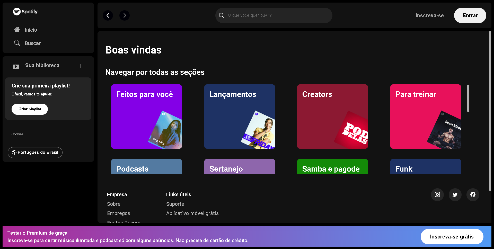

<h1 align="center">Clone do Site Spotify</h1>

  <a href="#-tecnologias">Tecnologias</a>&nbsp;&nbsp;&nbsp;|&nbsp;&nbsp;&nbsp;
  <a href="#-projeto">Projeto</a>&nbsp;&nbsp;&nbsp;|&nbsp;&nbsp;&nbsp;
  <a href="#-funcionalidades">Funcionalidades</a>&nbsp;&nbsp;&nbsp;&nbsp;&nbsp;&nbsp;

 

  

## 🚀 Tecnologias

Esse projeto foi desenvolvido com as seguintes tecnologias:

- HTML5
- CSS3
- JavaScript
- Git e Github

### 💻 Projeto.

Projeto construido durante a Imersão Front-end da Alura.
- [Acesse o projeto finalizado, online](https://devgaab.github.io/proj-clone-spotify/)

### ⚙ Funcionalidades

- Barra de navegação simples
- Scrollbar personalisado

---